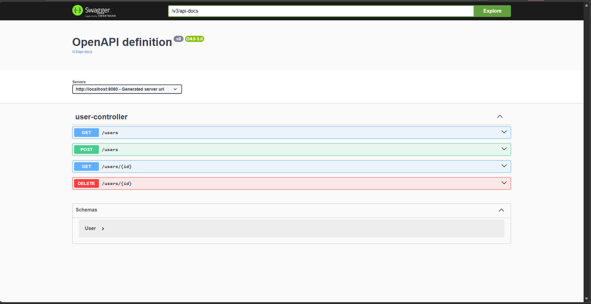
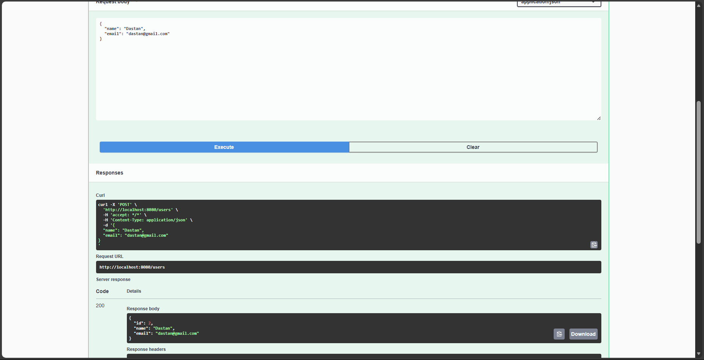
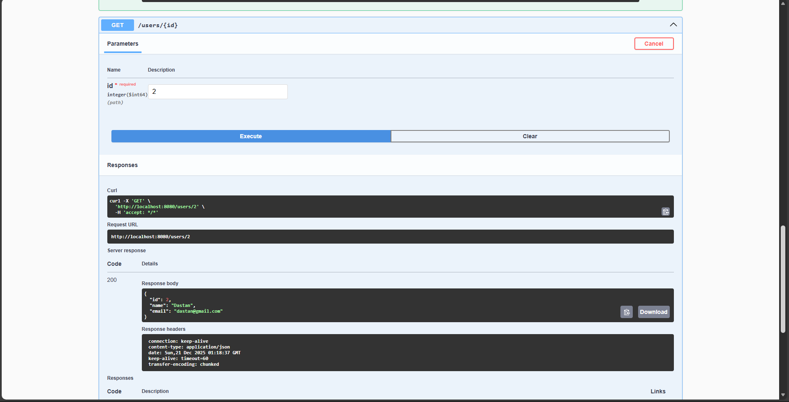
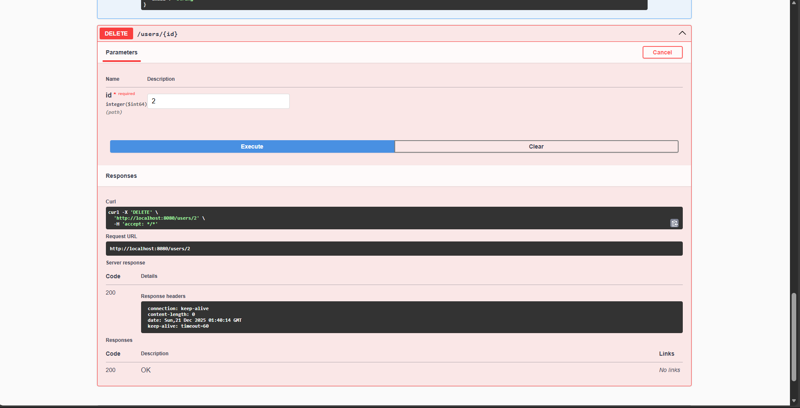
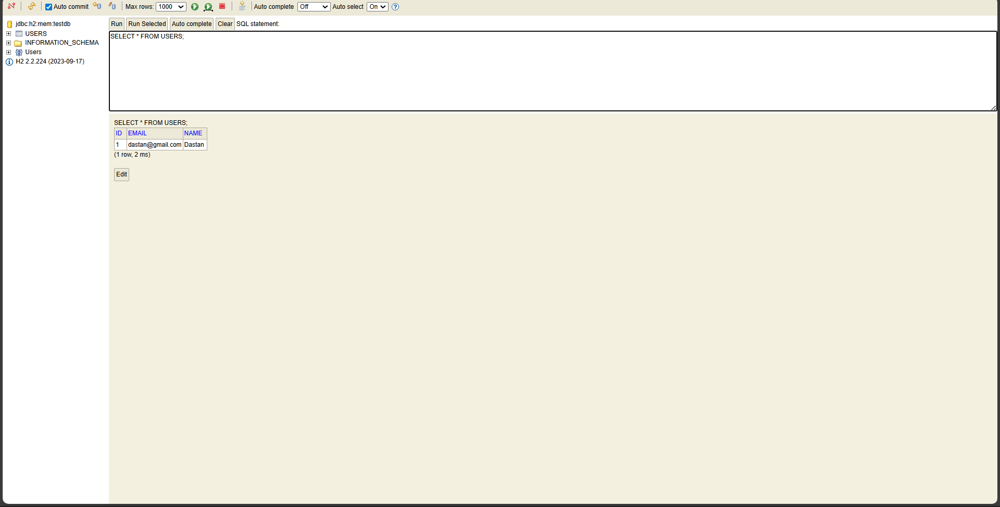
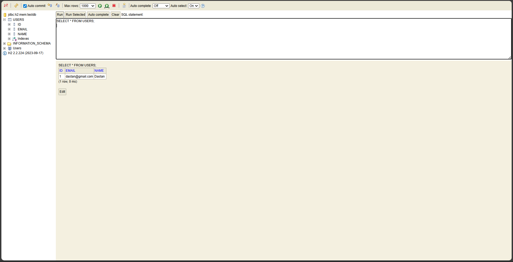

Task 2 is a Spring Boot REST API application created as part of the Spring Framework course.
The goal of this project is to show how a simple backend application works using REST principles.
The application allows creating users, retrieving users from the database, retrieving a single user by ID and deleting users. Communication with the application is done using HTTP methods such as GET, POST and DELETE.

The project was implemented using Java and Spring Boot. The application follows a basic layered structure with controller, service and repository layers. The controller is responsible for handling HTTP requests, the service contains business logic, and the repository is used for communication with the database using Spring Data JPA. The User entity represents a database table and contains fields such as id, name and email. The id is generated automatically by the database.

The application was tested using Swagger UI, which provides an easy way to send HTTP requests directly from the browser. Swagger is available at http://localhost:8080/swagger-ui/index.html
. Using Swagger, a new user can be created with a POST request, all users can be retrieved with a GET request, a single user can be retrieved by ID, and a user can be deleted using a DELETE request. Screenshots showing these operations are included in the screenshots folder and demonstrate that the API works correctly.

An H2 in-memory database is used to store application data. The database can be accessed using the H2 Console at http://localhost:8080/h2-console
. After creating a user through the REST API, the data can be verified directly in the database using a SQL query such as SELECT * FROM USERS. Screenshots of the H2 Console before and after deleting users are also included to show that database operations are executed correctly.

The application was run locally using IntelliJ IDEA and tested on localhost. Because an in-memory database is used, all data is removed when the application is restarted. This project demonstrates a basic but complete REST API application built with Spring Boot, including request handling, data persistence, API testing and documentation.

 Screenshots

 Swagger – available endpoints

 Create user (POST /users)

 Get user by ID (GET /users/{id})

 H2 database – users table

 H2 database after deleting user

